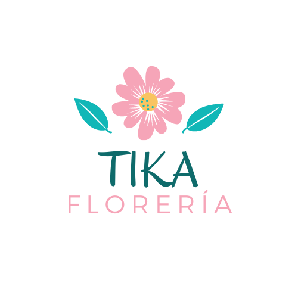

# Floreria TIKA
<p align="center">
  
</p>

## Integrantes
- Kemely Castillo Caccire
- Lesly Mita Yagua
- Jerson Zúñiga Coayla

## Requisitos
- `python3`
- `Django 3.0.8`

### Usando y activando un entorno virtual
```
python -m venv venv
. venv/bin/activate

```
<p align="center">
  
</p>

## Estilos de Programacion
- Pipeline
- Cookbook
- Trinity

## Principios SOLID

- Single Responsibility Principle

```python
class Estado(models.Model):
    nombre_estado = models.CharField(max_length=13)

    def __str__(self):
        return self.nombre_estado

class Flor(models.Model):
    imagen = models.ImageField(null=True, blank=True)
    nombre = models.CharField(max_length=50, primary_key=True)
    valor = models.IntegerField()
    descripcion = models.CharField(max_length=150)
    estado = models.ForeignKey(Estado, on_delete=models.DO_NOTHING)
    stock = models.IntegerField() 

    def __str__(self):
        return self.nombre

```

- Interface Segregation
```python
def home(request):
    return render(request, 'core/home.html')
def contacto(request):
    return render(request, 'core/contacto.html')
def tienda(request):
    flores = Flor.objects.all()
    return render(request, 'core/tienda.html', {'flores':flores})

```

