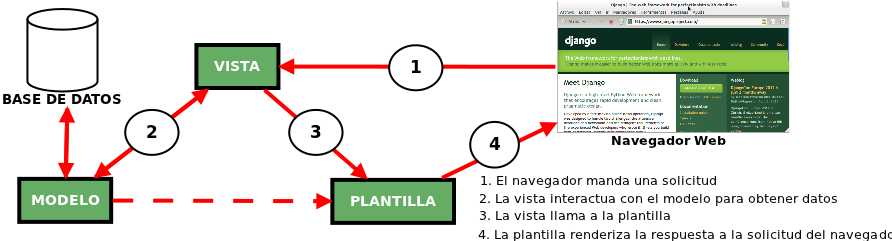

<p align="center">
  
</p>

---

# Florería Dulces Detalles
Dulces Detalles es una plataforma web que nos va a permitir realizar compras de arreglos de flores basado en una tienda  virtual ,ademas de ofrecer un portal didáctico que permita registrar las personas que ingresen a la página  y realicen su pedido.

<p align="center">
  
</p>

### Proposito
Crear un sistema que ayude a incrementar el número de ventas y tener más cercanía con los clientes.
### Funcionalidades
El sistema debe:
- Tener por artículo:
  - Categoría a la que pertenece.
  - Descripción breve.
- Realizar operaciones sobre los pedidos:
  - Modificar, agregar, eliminar y consultar sobre un pedido.
  - Búsqueda de pedidos por cliente.
  - Modificación del estado de un pedido.
  
<p align="center">
  
</p>

### Arquitectura
Posee una organización de los 3 paquetes principales los cuales son vista, modelo y template utilizando el patrón arquitectónico MVT (Modelo Vista Template) en este patrón la vista actuaria como controlador, aunque con pequeños matices esto debido a que se utilizara el Framework Django.

<p align="center">
  
</p>

- **Vista**:la capa de la lógica de negocios.
   - Contiene clases para interactuar con el sistema para realizar una compra, pedido, registro, etc.
- **Template**:la capa de presentación.
   - Contiene clases para cada formularios que los actores usan para comunicarse con el sistema.
- **Modelo**:la capa de acceso a la base de datos.
   - Incluye clases de entidad para los usuarios y clases límite para la interfaz con el sistema de catálogo de productos.


## Prácticas de Codificación
(modificar Jerson)
Este proyecto sigue la guía de estilo [PEP 8](https://www.python.org/dev/peps/pep-0008/) para código en Python.

Podemos automatizar y chequear las convenciones de código usando herramientas como [pycodestyle](https://github.com/PyCQA/pycodestyle) y verificar si cumple con las recomendaciones para luego aplicar cambios de forma automática con [autopep8](https://github.com/hhatto/autopep8).

### Verificando convención de estilo según PEP8
Mostrando la primera ocurrencia de cada error
```shell
pycodestyle --first ./path/to/file
```


### Aplicando correcciones con autopep8
```shell
autopep8 --in-place ./path/to/file
```


## Estilos de Programación
### Pipeline
```python
```
### Objects
```python
```
### Trinity
(Debido a que se utiliza MVT)

### Restful


## Principios SOLID
### Single Responsibility Principle (SRP)
```python
```
### Open Closed Principle (OCP)
```python
```
### Liskov Substitution Principle (LSP)
```python
```
### Interface Segregation Principle (ISP)
```python
```
### Dependency Inversion Principle (DIP)
```python
```


## Conceptos Domain Driven Design (DDD)
### Ubiquitous Language
```python
```
### Entities
```python
```
### Value Objects
```python
```
### Services
```python
```
### Modules

### Aggregates
```python
```
### Factories
```python
```

### Repository
```python
```


## Ejecucion del proyecto
### Usando y activando un entorno virtual
```shell
python -m venv venv
. venv/bin/activate
```
### Instalando requisitos de desarrollo
```shell
pip install -r requirements
```

## Integrantes
- Kemely Castillo Caccire
- Lesly Mita Yagua
- Jerson Zúñiga Coayla

---
<p align="center">
  
</p>

